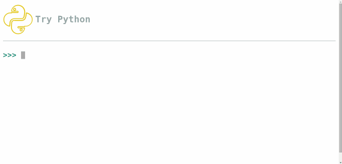

# Try python is a project inspired by [try-haskell](tryhaskell.org)

##### The goal of this project is to introduce python for new people by let they use a python REPL( Read, Eval, Print, Loop) in the browser.

## Getting Started

* Install python 2.x on your system
*  Install git
* Clone this repository
 
        git clone git@github.com:IuryAlves/TryPython.git
        cd TryPython

* Install python virtualenv: 
 
        sudo pip install virtualenv

* Create a virtualenv with python 3.4:
 
        virtualenv venv
        source venv/bin/activate

* Install project dependencies:

        pip install -r requirements.txt
        
* Run
        
     cd TryPython

     ./manage.py runserver 8000

Now, just access localhost:8000 =D

## And now?

There are a lot of things to do.

* You can check the issues of the project to know in what you can contribute
* You can access the wiki to know how run this using pypy in a sandbox and also discover how the security against malicious users are implemented.

This project uses [jquery.console](https://github.com/chrisdone/jquery-console)
